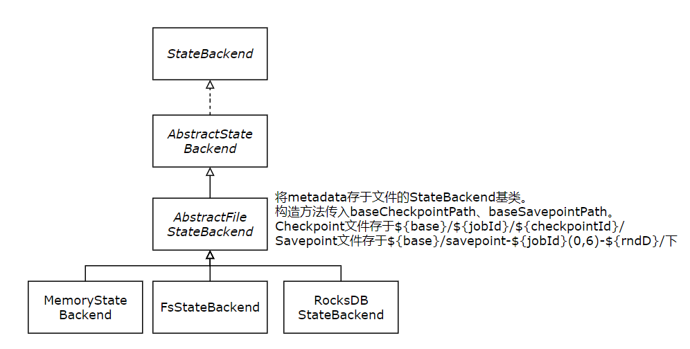

### 

#### WindowOperator

```java
public void processElement(StreamRecord<IN> ele) throws Exception{
    final Collection<W> eleWins = windowAssigner.assignWindows(ele...);
    if(windowAssigner instanceof MergingWindowAssigner){
        //可合并分配器处理逻辑
        	
    }else{
        //不可合并分配器处理逻辑
    }
    
    if(isSkippedElement && isElementLate(ele)){
        if(lateDataOutputTag!=null){
            sideOutput(ele);//旁路输出
        }else{
            this.numLateRecordsDropped.inc();//丢弃计数
        }
    }
}
{//可合并分配器处理逻辑
	MergingWindowSet mergingWindows = new MergingWindowSet(windowAssigner,mergingSetState);
    for(W window : eleWins){
        //经过合并后的窗口
        W actualWindow = mergingWindows.add(window,new MergingWindowSet.MergingFunction<W>(){});
        //清除超时窗口
        if(window.isEventTime() && (cleanupTime(window)<=internalTimerService.currentWatermark())){
            mergingWindows.retireWindow(actualWindow);continue;
        }
        W stateWindow = mergingWindows.getStateWindow(actualWindow);
        windowState.setCurrentNamespace(stateWindow);
        windowState.add(ele.getValue);
        triggerContext.key = key;
        triggerContext.window = actualWindow;
        TriggerResult triggerResult = triggerContext.onElement(ele);
        //触发输出逻辑,将窗口及数据发给userFunction.
        if(triggerResult.isFire()) emitWindowContents(actualWindow,contexts);
        if(triggerResult.isPurge()) windowState.clear();
        registerCleanupTimer(actualWindow);//加上allowedLateness作为内容清除时间.调用InternalTimerService注册超时时间.
    }
    mergingWindows.persist();//清除MergingWindowState中的ListState,将内存中的Map元素逐个添加到ListState中.
}
{//不可合并分配器处理逻辑
    for(W window: eleWins){
        if(isWindowLate(window)) continue;//丢弃超时窗口
        //设置namespace
        //将元素值加入liststate中
        //调用Trigger.onElement
        //若isFire调用emitWindowContents()输出至userFunction
        //若isPurge调用windowState.clear()
        //调用internalTimerService注册超时时间
    }
}
```

#### MergingWindowSet

```java
public W addWindow(W newWindow, MergeFunction<W> mergeFunction) throw Exception{
    List<W> windows = new ArrayList<>();
    windows.addAll(this.mapping.keySet);//存在内存Map中的状态(非Flink提供状态).
    windows.add(newWindow);
    
    final Map<W,Collection<W>> mergeResults = new HashMap<>();
    windowAssigner.mergeWindows(windows,new MergeWindowAssigner.MergeCallback())
}
```

# State管理

## State

```java
public interface State{
    void clear();
}
```

State仅可被KeyedStream中的方法访问。Key由系统自动提供，所以其中方法总是看到value指向当前元素的key。如此，系统可以将流及状态分区同时处理。


### CheckpointedFunction

```java
public interface CheckpointedFunction{
    void snapshot(FunctionSnapshotContext context) throw Exception;
    void initializeState(FunctionInitializationContext context) throw Exception;
}
```

`CheckpointedFunction`是有状态转换函数的核心接口，此类function在流记录中维持着状态。该接口灵活支持keyed state及operator state。

> Flink1.5之前使用`ListCheckpointed`处理`OperatorState`，1.5之后统一使用`CheckpointedFuntion`处理。

`AbstractStreamOperator` 有一成员变量`StreamOperatorStateHandler`，用于管理对应状态的初始化及快照。`StreamOperatorStateHandler`内部调用`CheckpointedFunction`的实现方法。

#### Initialization

`initializeState(FunctionInitializationContext) `于 `Transformation`分布式运行实例创建时调用。该方法允许`FunctionInitializationContext`的访问，`FunctionInitializationContext`又将访问权赋予`OperatorStateStore`及`KeyedStateStore`。`OperatorStateStore`及`KeyedStateStore`提供对实际存储状态的访问，如`ValueState`及`ListState`。

> `KeyedStateStore` 仅被用于调用过`keyBy()`的`DataStream`。

#### Snapshot

`snapshotState(FunctionSnapshotContext)`在检查点对状态执行快照保存时调用。方法内部通常保证设置检查点的数据结构是最新的。snapshot context提供对检查点元数据的访问。

> 可使用此方法作为与外部系统同步的hook。

### RuntimeContext

```java
public interface RuntimeContext{
    <T> ValueState<T> getState(ValueStateDescriptor<T> stateProperties);
    <T> ListState<T> getListState(ListStateDescriptor<T> stateProperties);
    <T> ReducingState<T> getReducingState(ReducingStateDescriptor<T> stateProperties);
	<IN, ACC, OUT> AggregatingState<IN, OUT> getAggregatingState(AggregatingStateDescriptor<IN, ACC, OUT> stateProperties);
    <UK, UV> MapState<UK, UV> getMapState(MapStateDescriptor<UK, UV> stateProperties);
}
```

`RuntimeContext` 可用于获取`KeyedState` 实例，仅适用于执行过`keyBy()`操作后的`KeyedStream`。

`RuntimeContext`包含functions运行时信息。function的每个并行实例均有一个可访问静态环境信息、累加器、广播变量等。

可通过`AbstractRichFunction.getRuntimeContext()`获取运行时环境。

`RuntimeContext` 实现类 `StreamingRuntimeContext` 内部维护一个成员变量 `KeytedStateStore`。以上状态的获取均来自对应 `KeyedStateStore`。

## StateBackend


```java
public interface StateBackend{
    resovleCheckpointLocation(String externalPointer) throws IOException;
    createCheckpointStorage(JobID jobId) throws IOException;
    createKeyedStateBackent() throws IOException;
    createOperatorStateBackend(env,opIdentifier,handler,cancel) Throws Exception;
}
```

StateBackend定义了如何进行流应用**状态保存**及**检查点处理**。不同的StateBackend使用不同的数据结构及策略管理状态。

1. MemoryStateBackend将state存于TaskManager中，将checkpoint存于JobManager中。MemoryStateBackend不使用外部依赖，轻量级，但不支持高可用且只适用于小容量的状态。
2. FsStateBackend将状态存于TaskManager堆内存，将检查点存于文件系统（如HDFS，S3等）。
3. RocksDBStateBackend将状态存于RocksDB，默认将检查点存于文件系统。


字节存储及Backends（Raw Bytes Storage and Backends）

StateBackend提供对字节数据存储、KeyedState、OperatorState的服务。（通过CheckpointStreamFactory）对字节数据的存储提供基础的容错服务。JobManager保存checkpoint，恢复元数据，存储带checkpoint的KeyedState、OperatorState也使用类此容错服务。StateBackend创建的AbstractKeyedStateBackend及OperatorStateBackend定义了如何保存工作中的状态。


Serializability

StateBackend需要可序列化，因其与代码一同分布在并行的处理进程上。因此，**StateBackend的实现类（通常是AbstractStateBackend的子类）更像是一个工厂**，该工厂生成可访问持久存储、持有KeyedState及OperatorState的数据结构。因此，StateBackend相当轻量，仅包含一些配置信息，序列化很方便。


Thread Safety

StateBackend的实现类必须线程安全，因可能由多个线程同时创建流及StateBackend。

### implements



#### MemoryStateBackend

MemoryStateBackend管理TaskManager虚拟机堆内存中的工作状态。MemoryStateBackend直接将状态checkpoint到JobManager的内存中，但这些checkpoint会因HA设置及savepoint被持久化到文件系统。MemoryStateBackend是基于文件系统的StateBackend，无法在无文件系统依赖条件下使用。

MemoryStateBackend应只用于测试、快速本地设置、及仅含轻量级状态的应用，因其将checkpoint存于JobManager的内存中，大容量的state会占用JobManager大量的主存。FsStateBackend的state也存于TaskManager，但其checkpoint直接存放在外部系统。

#### FsStateBackend

FsStateBackend将working state放于TaskManager虚拟机堆内存，将state checkpoint存于文件系统（如HDFS,S3等）。每次checkpoint会在base目录下创建chk-num目录以存放文件。

working state存于TaskManager虚拟机堆内存中。若一个TaskManager多个slot并行执行任务，那么所有任务对应的aggregate state将存于JobManager中。FsStateBackend存储带metadata的状态小块，以避免产生大量的小文件。获取整个checkpoint的metadata存于JobManager中。

FsStateBackend的Checkpoint数据存于外部文件系统。FsStateBackend支持savepoint及外部checkpoint。

FsStateBackend可在单个应用中完成配置，亦可使用Flink全局配置。

### api

createCheckpointStorage(jobId) : CheckpointStorage

为指定job创建一个CheckpointStorage，CheckpointStorage用于写入检查点数据及元数据。


<K> AbstractKeyedStateBackend<K> createKeyedStateBackend(
		Environment env,
		JobID jobID,
		String operatorIdentifier,
		TypeSerializer<K> keySerializer,
		int numberOfKeyGroups,
		KeyGroupRange keyGroupRange,
		TaskKvStateRegistry kvStateRegistry,
		TtlTimeProvider ttlTimeProvider,
		MetricGroup metricGroup,
		@Nonnull Collection<KeyedStateHandle> stateHandles,
		CloseableRegistry cancelStreamRegistry) throws Exception;

创建一个AbstractKeyedStateBackend，用于处理KeyedState的保存及checkpoint操作。


OperatorStateBackend createOperatorStateBackend(
		Environment env,
		String operatorIdentifier,
		@Nonnull Collection<OperatorStateHandle> stateHandles,
		CloseableRegistry cancelStreamRegistry) throws Exception;

创建一个OperatorStateBackend，用于存储OperatorState。OperatorState关联并行的operator或function，不同于KeyedState关联于指定key。

### factory product


#### OperatorStateBackend

#### AbstractKeyedStateBackend

## OperatorStateStore

OperatorStateStore提供注册带有可管理存储operator state的方法。

```java
public interface OperatorStateStore{
    <K,V>BroadcastState<K,V> getBroadcastState(MapStateDescriptor) throws Exception;
    <S>ListState<S> getListState(ListStateDescriptor) throws Exception;
    <S>ListState<S> getUnionListState(ListStateDescriptor) throws Exception;
    Set<String> getRegisteredStateNames();
    Set<String> getRegisteredBroadcastStateNames();
}
```

### implements

#### OperatorStateBackend

OperatorStateBackend同时继承了OperatorStateStore及SnapshotStrategy。

## KeyedStateStore

OperatorStateStore提供注册带有可管理存储keyed state的方法。

```java
pulic interface KeyedStateStore{
    <T>ValueState<T> getState(ValueStateDescriptor) throws Exception;
    <T>ListState<T> getListState(ListStateDescriptor) throws Exception;
    <T>ReducingState<T> getReducingState(ReducingStateDescriptor) throws Exception;
    <IN,ACC,OUT>AggregatingState<IN,OUT> getAggregatingState(AggregatingStateDescriptor) throws Exception;
    <UK,UV>MapState<UK,UV> getMapState() throws Exception;
}
```


## KeyedStateBackend

## SnapshotStrategy